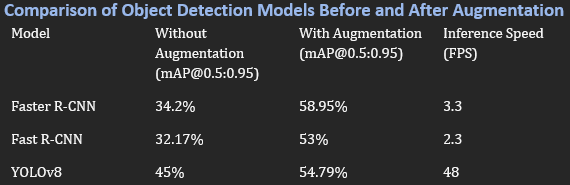

# RCNN_VS_YOLO

## Results

### Comparison Table

### YOLO Detection

### Faster R-CNN Detection

## Key Findings and Observations
- **Faster R-CNN** shows a significant improvement in **mAP@0.5:0.95** after augmentation (**from 34.2% to 58.95%**), highlighting its sensitivity to data augmentation, and its usage on saved past videos.
- **YOLOv8** also benefits from augmentation (**from 45% to 54.75%**) but to a lesser extent compared to Faster R-CNN.
- **YOLOv8** maintains a higher inference speed (**48 FPS**) compared to **Faster R-CNN (3.3 FPS)** & **Fast R-CNN (2.3 FPS)**, making it preferable for real-time applications.
